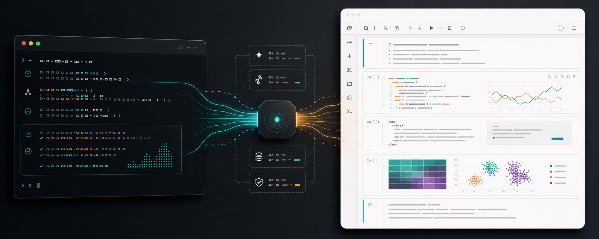
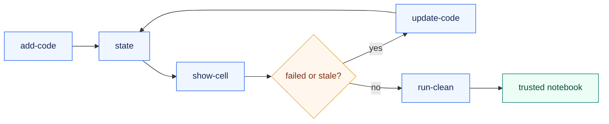

# Notebook Lens

<p align="center">
  
</p>

<p align="center">
  
  
  
</p>

Notebook Lens is a shell-native control plane for agents to create, execute,
inspect, repair, and validate standard Jupyter notebooks without taking over the
human notebook UI.

The agent drives the notebook from the shell. The user opens the same `.ipynb`
in JupyterLab, classic Jupyter Notebook, or VS Code.

## Why

Use Notebook Lens when the final artifact should be a normal notebook, but the
work is being done by an agent:

- build research notebooks one cell at a time
- keep a persistent kernel across CLI calls
- inspect and repair failed or stale cells
- detect source/output divergence after human edits
- rerun from a fresh kernel with `run-clean` when the notebook needs to become evidence
- export rich outputs only when the agent explicitly asks for files

It is not a notebook UI, scheduler, reactive notebook system, or notebook diff
tool. It keeps the boring pieces: standard `.ipynb`, `ipykernel`, and Jupyter
viewers.

## Loop



## Quickstart

```sh
python -m venv .venv
. .venv/bin/activate
python -m pip install -e .

notebook-lens new explore.ipynb
notebook-lens add-code explore.ipynb --desc "Probe" --code 'print("hello")'
notebook-lens state explore.ipynb --outputs summary
```

Open the notebook with your normal viewer:

```sh
jupyter lab explore.ipynb
# or: jupyter notebook explore.ipynb
# or: code explore.ipynb
```

By default, Notebook Lens treats the current directory as the experiment root,
resolves notebook paths relative to that root, stores runtime state under
`./.notebook_lens`, and does not impose an artifact directory.

Want a notebooks folder? Use it explicitly: `notebook-lens new notebooks/explore.ipynb`.

## Commands

```sh
notebook-lens add-code explore.ipynb --file cell.py
notebook-lens update-code explore.ipynb --id ab12cd34 --file fixed.py
notebook-lens add-markdown explore.ipynb --file note.md
notebook-lens show-cell explore.ipynb --id ab12cd34 --outputs full
notebook-lens export-output explore.ipynb --id ab12cd34 --dir tmp/rich-output
notebook-lens run-clean explore.ipynb
```

Use `--json` for structured agent output. Use `notebook-lens --help` for the
full command surface.

## Safety Rails

Notebook Lens stores execution metadata in cell metadata and uses it to warn
agents before they trust stale notebook state:

- external notebook edits reset trust in the live kernel
- code cells track the source hash that produced saved outputs
- downstream cells are marked stale after upstream edits
- failed cells block blind appends
- `run-clean` recomputes from a fresh kernel
